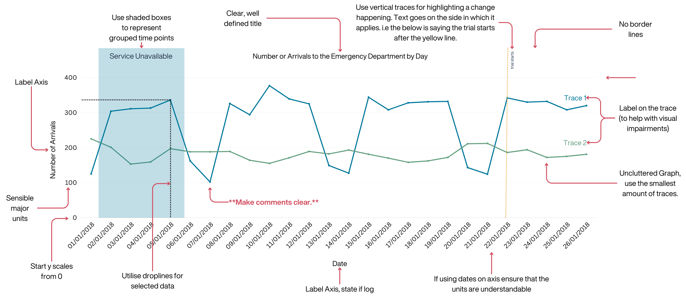
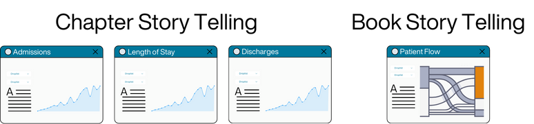

# Graphing Visual Vocabulary

Graphing Visual Vocabulary (GVV) refers to the visual elements, principles, and techniques used in creative disciplines. For data professionals, its represents the way that we visually communicate information to users.

Similar to how marketers use information and visual cues to persuade people, GVV uses the same understanding of human interaction to bring the users attention to key facts information. If used poorly, critical information can be missed, misinterpreted or users will avoid the information entirely. Learning how to communicate information is critical for any data professional, but especially Analysts and Data Scientists. 

In this mini chapter, we provide a checklist of core design principles for creating effective visualisations.  

### Design Graphs

Here is the Data Science & OR teams default visual template for graphs

###### Design Graphs Checklist

- [ ] Graph has a title

- [ ] X and Y axis has a title

- [ ] Font is accessible

- [ ] Colours are accessible 

- [ ] Sensible units used (and labelled)

- [ ] Y scale starts from 0

- [ ] Drop lines turned on

- [ ] No more than 5 traces per graph

- [ ] Sensible major and minor units

- [ ] Chart area borderlines have been removed 

- [ ] Traces are annotated

- [ ] Critical Information is labelled (with area or annotation)

- [ ] Graph explanation added

### Consider the Audience

Spend time working with your audience to understand at what level is their data literacy, what can they access, how familiar are they with maths, do they have accessibility requirements. This information is crucial to creating a report that the user will want to use. 

###### Consider the Audience Checklist

- [ ] **Familiarity:** Ensure that the user is familiar with the types of graph or technologies you are going to use.

- [ ] **Availability:** Ensure that the information is refreshable in a timeframe that the user requires

- [ ] **Accessibility:** Ensure that people are able to access the information, for example is it colour blind friendly.

- [ ] **Data Literacy:** Does the user have the Data Literacy to use your report?

- [ ] **Extraction Criteria and Information source:** Does the report clearly state the source of the information and the filters applied?

### Keep it Simple

Removing or reducing unnecessary artefacts from the visualisation helps users quickly find relevant information and prevents them getting distracted. Dashboards should aim to focus on delivering a single key message per page / dashboard tab.

###### Keep it Simple Checklist

- [ ] **Single Message:** Ensure that each page or dashboard tab is only trying to communicate one message. For example, one tab for Admissions, one tab for Discharges etc. 

- [ ] **Remove Clutter**: Remove any unnecessary tables, graphs or parameters, especially if they are repeating or showing conflicting information.  

- [ ] **Be Consistent:** Ensure that each page / tab follows the same layout pattern. 

- [ ] **Scalability:** Ensure the information scales between screen sizes

### Colours and Fonts

Choosing the right colours for data visualisations is crucial for conveying information effectively and ensuring accessibility, here are the core principles:

###### Colours and fonts checklist

- [ ] **Limited Colour Palette**: Limit your colour choices to a small, harmonious palette of 2-4 colours. This makes it easier for viewers to interpret the data and reduces visual clutter.

- [ ] **Contrasting Colours**: Ensure that data points or categories are distinguishable through colour contrast. For example, use dark colours for data points on a light background or vice versa. Avoid using colours that are too similar, as they can lead to confusion.

- [ ] **Avoid Red-Green Combinations**: Red-green colour combinations should be used sparingly, as they can be problematic for individuals with colour vision deficiencies. Consider using alternatives like blue-orange or purple-yellow.

- [ ] **Gradient Scales**: If you're using gradients, make sure they have a clear and logical progression. For example, in heatmaps, use a gradient that smoothly transitions from low to high values.

- [ ] **Avoid Overuse of Bright or Neon Colours**: Bright or neon colours can be visually fatiguing when used excessively. Reserve them for highlighting specific data points or elements.

- [ ] **Maintain Consistency**: If you're using the same colour scheme across multiple visualisations or within a larger project, maintain consistency to help viewers associate specific colours with particular data categories or meanings.

If you are unsure, consider using the default options available in libraries like [Seaborn ]([Choosing color palettes — seaborn 0.13.2 documentation (pydata.org)](https://seaborn.pydata.org/tutorial/color_palettes.html))or [Plotly]([Built-in continuous color scales in Python (plotly.com)](https://plotly.com/python/builtin-colorscales/)), these have already been tested to ensure they are visually clear. There are also a large amount of websites available that allow you to build colour maps. 

### Standardisation

Standardisation allows users to quickly navigate your reports. A user should be able to easily identify that a report came from your team (or organisation). This is achieved by having a consistent template between reports. If you haven't already, as a team you should agree a template style. 

###### Standardise Checklist

- [ ] **Corporate Identity:** Does the dashboard follow the teams corporate identity

- [ ] 
- [ ] **Layout:** Ensure that the report has the same layout throughout

- [ ] **Common Scales:** Ensure that all graphs are using the same scale, and where this is not possible make it clear to the user that the scale has changed using annotations. 

### Reasonable Demands of the User

All reports should be easy to find and navigate. You should ensure that the report respects the time of the user by limiting the need to move around the report unnecessarily. 

###### Reasonable Demands of the User Checklist

- [ ] **Limit Parameters:** Ensure the page has less than 5 total parameters, instead replace with interactive visualisations (sliders, spark Lines, transforms, callbacks etc.)

- [ ] **Limit Unnecessary Movement:** Ensure the user does not have to move between tabs, or reports to find contextual information relating to the page

### Story Telling

Relaying information to users works best when there is a narrative or story behind the information. Consider this example of admissions. 

We could either use **chapter story telling** (where the story is over multiple tabs) by using individual tabs explaining admissions, moving on to flow metrics like length of stay & occupancy, then discharges, and finally readmissions. Or we could explain this with **book story telling** (Where the entire story is within one graph or tab) by utilising a flow diagram like Sankey. Both are valid, but you should consider the audience when choosing. All stories should be accompanied by explanatory text!

###### Story Telling Checklist

- [ ] **One clear story:** You can identify a story when looking at the report, all the information pertains to the story (remove any that don't!)

- [ ] **No story is complete without text:** All graphs have explanatory text that adds more context to the story

### Choosing the Correct Graph

Stuck creating line charts? Here is a handy guide to finding the best visualisation, just remember to consider your audience!

